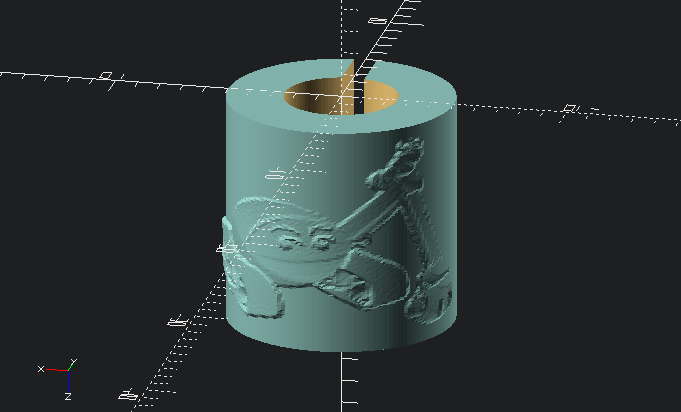

# customisable-bike-pin

## Installation

Generate your design with [JustinSDK/img2gray](https://github.com/JustinSDK/img2gray) tool

stl file is available in [here](https://github.com/mrdarip/customisable-bike-pin/blob/main/bike_pin.stl)